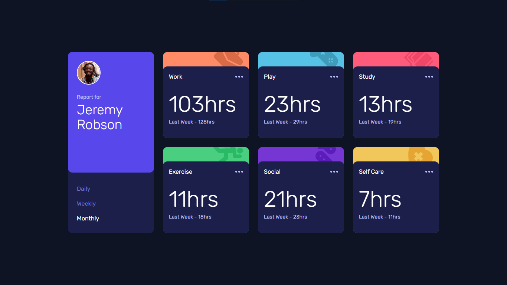

# Time tracking dashboard 

This is a solution to the [Time tracking dashboard challenge on Frontend Mentor](https://www.frontendmentor.io/challenges/time-tracking-dashboard-UIQ7167Jw).

## Table of contents

- [Overview](#overview)
  - [The challenge](#the-challenge)
  - [Screenshot](#screenshot)
  - [Links](#links)
- [My process](#my-process)
  - [Built with](#built-with)
  - [Useful resources](#useful-resources)
- [Author](#author)

## Overview

### The challenge

Users should be able to:

- View the optimal layout for the site depending on their device's screen size
- See hover states for all interactive elements on the page
- Switch between viewing Daily, Weekly, and Monthly stats

### Screenshot

### Links

- Live Site URL: [Visite site](https://zakaria-lagouader.github.io/time-tracking-dashboard)

## My process

### Built with

- [React](https://reactjs.org/) - JS library
- [Tailwindcss](https://tailwindcss.com/) - Css library
- [Typescript](https://www.typescriptlang.org/) - Language

### Useful resources

- [Tailwindcss Docs](https://tailwindcss.com/docs/installation) - This helped me for the utility classes

## Author

- Website - [Zakaria Lagouader](https://zakaria-lagouader.github.io/portfolio/)
- Frontend Mentor - [@zakaria-lagouader](https://www.frontendmentor.io/prof